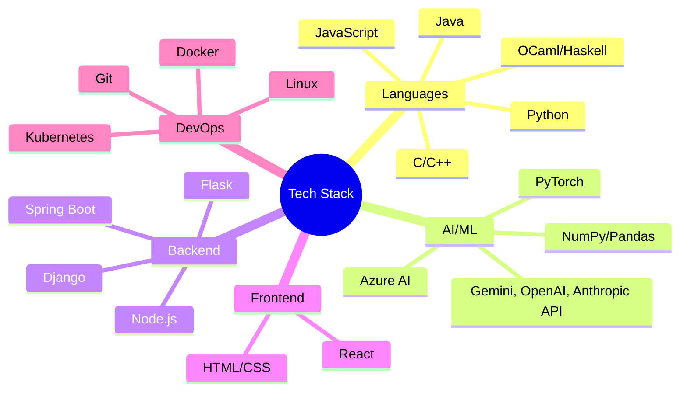

# 👋 Hi, I'm Jamie!

<!--  
 -->

> *Bridging the gap between AI innovation and practical software engineering*

## 🤖 About Me

Computer Science student at the University of Stirling with a passion for AI/ML and full-stack development. Recently returned from studying at San Diego State University, where I deepened my expertise in AI and distributed systems. Currently working on multi-modal AI applications for medical imaging while exploring the frontiers of prompt engineering and LLM applications.

## 🔭 Current Focus

- 🎓 Completing my final year of BSc Computer Science
- 🌱 Teaching and inspiring next-gen developers as an Undergraduate Teaching Assistant
- 💻 Competing and learning through industry hackathons
- 🚀 Building scalable, software and AI-powered solutions

<!-- 
## 🛠️ Tech Stack

-->
## 🏆 Recent Achievements

- 🥇 JPMorgan Code For Good Hackathon Champion (1st out of 10 teams)
- 🦾 AtkinsRéalis HackAFuture Hackathon (5th out of 20 teams)
- 💼 Technology Infrastructure Analyst at Citigroup

<!-- 
## 📈 Featured Projects

<table>
  <tr>
    <td align="center">
      
       
      Multi-Modal AI for Medical Imaging
    </td>
    <td align="center">
      
       
      ML-Powered Trading Platform
    </td>
    <td align="center">
      
       
      Python Automation Tools
    </td>
  </tr>
</table>
-->

## 🤝 Let's Connect!

I'm always excited to connect with fellow developers, researchers, and tech enthusiasts! Whether you're interested in:
- Start-ups
- Discussing the latest in tech
- Building something together

Let's connect and create something remarkable!

📫 Reach me at: jamieclements72243@gmail.com

---

  🚀 Always learning, always building, always innovating

